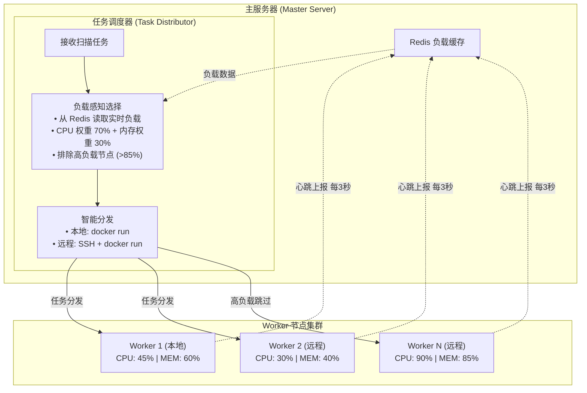

<h1 align="center">Xingrin - 星环</h1>

<p align="center">
  <b>一款现代化的企业级漏洞扫描与资产管理平台</b><br>
  提供自动化安全检测、资产发现、漏洞管理等功能
</p>

<p align="center">
  <b>🌗 明暗模式切换</b>
</p>

<p align="center">
  
  
</p>

<p align="center">
  <b>🎨 多种 UI 主题</b>
</p>

<p align="center">
  
  
  
</p>

## 📚 文档

- [📖 技术文档](./docs/README.md) - 技术文档导航（🚧 持续完善中）
- [🚀 快速开始](./docs/quick-start.md) - 一键安装和部署指南
- [🔄 版本管理](./docs/version-management.md) - Git Tag 驱动的自动化版本管理系统
- [📦 Nuclei 模板架构](./docs/nuclei-template-architecture.md) - 模板仓库的存储与同步
- [📖 字典文件架构](./docs/wordlist-architecture.md) - 字典文件的存储与同步
- [🔍 扫描流程架构](./docs/scan-flow-architecture.md) - 完整扫描流程与工具编排


---

## ✨ 功能特性

### 🎯 目标与资产管理
- **组织管理** - 多层级目标组织，灵活分组
- **目标管理** - 支持域名、IP目标类型
- **资产发现** - 子域名、网站、端点、目录自动发现
- **资产快照** - 扫描结果快照对比，追踪资产变化

### 🔍 漏洞扫描
- **多引擎支持** - 集成 Nuclei 等主流扫描引擎
- **自定义流程** - YAML 配置扫描流程，灵活编排
- **定时扫描** - Cron 表达式配置，自动化周期扫描

#### 扫描流程架构

完整的扫描流程包括：子域名发现、端口扫描、站点发现、URL 收集、目录扫描、漏洞扫描等阶段

```mermaid
flowchart LR
    START["开始扫描"]
    
    subgraph STAGE1["阶段 1: 资产发现"]
        direction TB
        SUB["子域名发现<br/>subfinder, amass, puredns"]
        PORT["端口扫描<br/>naabu"]
        SITE["站点识别<br/>httpx"]
        SUB --> PORT --> SITE
    end
    
    subgraph STAGE2["阶段 2: 深度分析"]
        direction TB
        URL["URL 收集<br/>waymore, katana"]
        DIR["目录扫描<br/>ffuf"]
    end
    
    subgraph STAGE3["阶段 3: 漏洞检测"]
        VULN["漏洞扫描<br/>nuclei, dalfox"]
    end
    
    FINISH["扫描完成"]
    
    START --> STAGE1
    SITE --> STAGE2
    STAGE2 --> STAGE3
    STAGE3 --> FINISH
    
    style START fill:#34495e,stroke:#2c3e50,stroke-width:2px,color:#fff
    style FINISH fill:#27ae60,stroke:#229954,stroke-width:2px,color:#fff
    style STAGE1 fill:#3498db,stroke:#2980b9,stroke-width:2px,color:#fff
    style STAGE2 fill:#9b59b6,stroke:#8e44ad,stroke-width:2px,color:#fff
    style STAGE3 fill:#e67e22,stroke:#d35400,stroke-width:2px,color:#fff
    style SUB fill:#5dade2,stroke:#3498db,stroke-width:1px,color:#fff
    style PORT fill:#5dade2,stroke:#3498db,stroke-width:1px,color:#fff
    style SITE fill:#5dade2,stroke:#3498db,stroke-width:1px,color:#fff
    style URL fill:#bb8fce,stroke:#9b59b6,stroke-width:1px,color:#fff
    style DIR fill:#bb8fce,stroke:#9b59b6,stroke-width:1px,color:#fff
    style VULN fill:#f0b27a,stroke:#e67e22,stroke-width:1px,color:#fff
```



详细说明请查看 [扫描流程架构文档](./docs/scan-flow-architecture.md)

### 🖥️ 分布式架构
- **多节点扫描** - 支持部署多个 Worker 节点，横向扩展扫描能力
- **本地节点** - 零配置，安装即自动注册本地 Docker Worker
- **远程节点** - SSH 一键部署远程 VPS 作为扫描节点
- **负载感知调度** - 实时感知节点负载，自动分发任务到最优节点
- **节点监控** - 实时心跳检测，CPU/内存/磁盘状态监控
- **断线重连** - 节点离线自动检测，恢复后自动重新接入



**负载感知调度算法：**
1. **实时监控** - Worker 每 3 秒上报 CPU/内存/磁盘状态到 Redis (TTL 15秒)
2. **智能选择** - 任务提交时从 Redis 读取所有在线节点负载，计算加权分数 (CPU×0.7 + MEM×0.3)
3. **动态分发** - 自动选择负载最低的节点执行任务，高负载节点 (>85%) 自动跳过
4. **降级策略** - 所有节点高负载时等待 60 秒后重试，避免系统过载

### 📊 可视化界面
- **数据统计** - 资产/漏洞统计仪表盘
- **实时通知** - WebSocket 消息推送
- **暗色主题** - 支持明暗主题切换

---

## 🛠️ 技术栈

- **前端**: Next.js + React + TailwindCSS
- **后端**: Django + Django REST Framework
- **数据库**: PostgreSQL + Redis
- **部署**: Docker + Nginx

### 🔧 内置扫描工具

| 类别 | 工具 |
|------|------|
| 子域名爆破 | puredns, massdns, dnsgen |
| 被动发现 | subfinder, amass, assetfinder, Sublist3r |
| 端口扫描 | naabu |
| 站点发现 | httpx |
| 目录扫描 | ffuf |
| 爬虫 | katana |
| 被动URL收集 | waymore, uro |
| 漏洞扫描 | nuclei, dalfox |

---

## 📦 快速开始

### 环境要求

- **操作系统**: Ubuntu 20.04+ / Debian 11+ （推荐）
- **硬件**: 2核 4G 内存起步，10GB+ 磁盘空间

### 一键安装

```bash
# 克隆项目
git clone https://github.com/yyhuni/xingrin.git
cd xingrin

# 安装并启动（生产模式）
sudo ./install.sh

# 开发模式
sudo ./install.sh --dev
```

### 访问服务

- **Web 界面**: `https://localhost` 或 `http://localhost`

### 常用命令

```bash
# 启动服务
sudo ./start.sh

# 停止服务
sudo ./stop.sh

# 重启服务
sudo ./restart.sh

# 卸载
sudo ./uninstall.sh

# 更新
sudo ./update.sh
```
## 日志
- 项目日志：/opt/xingrin/logs 下存储了这个项目的运行日志信息，error文件存储了错误相关信息，xingrin.log存储了包括错误在内的所有项目日志
- 工具调用日志：/opt/xingrin/results 下存储了工具的运行结果日志，比如naabu，httpx等的结果调用日志

## 🤝 反馈与贡献

- 🐛 **如果发现 Bug** 可以点击右边链接进行提交 [Issue](https://github.com/yyhuni/xingrin/issues)
- 💡 **有新想法，比如UI设计，功能设计等** 欢迎点击右边链接进行提交建议 [Issue](https://github.com/yyhuni/xingrin/issues)
- 🔧 **想参与开发？** 关注我公众号与我个人联系

## 📧 联系
- 目前版本就我个人使用，可能会有很多边界问题
- 如有问题，建议，其他，优先提交[Issue](https://github.com/yyhuni/xingrin/issues)，也可以直接给我的公众号发消息，我都会回复的

- 微信公众号: **洋洋的小黑屋**


## ⚠️ 免责声明

**重要：请在使用前仔细阅读**

1. 本工具仅供**授权的安全测试**和**安全研究**使用
2. 使用者必须确保已获得目标系统的**合法授权**
3. **严禁**将本工具用于未经授权的渗透测试或攻击行为
4. 未经授权扫描他人系统属于**违法行为**，可能面临法律责任
5. 开发者**不对任何滥用行为负责**

使用本工具即表示您同意：
- 仅在合法授权范围内使用
- 遵守所在地区的法律法规
- 承担因滥用产生的一切后果

## 📄 许可证

本项目采用 [PolyForm Noncommercial License 1.0.0](LICENSE) 许可证。

### 允许的用途

- ✅ 个人学习和研究
- ✅ 非商业安全测试
- ✅ 教育机构使用
- ✅ 非营利组织使用

### 禁止的用途

- ❌ **商业用途**（包括但不限于：出售、商业服务、SaaS 等）
- ❌ 未经授权的渗透测试
- ❌ 任何违法行为

如需商业授权，请联系作者。

