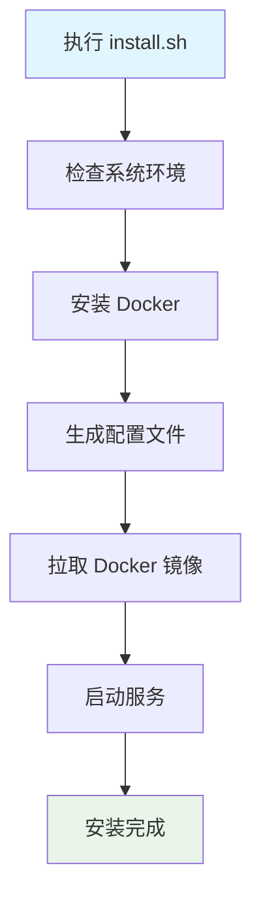

# 🚀 XingRin - 星环 快速开始

## 系统要求

### 硬件要求
- **CPU**: 2 核心以上
- **内存**: 4GB 以上
- **存储**: 20GB 可用空间
- **网络**: 互联网连接（用于拉取 Docker 镜像）

### 软件要求
- **操作系统**: Ubuntu 18.04+ / Debian 10+
- **权限**: sudo 管理员权限
- **端口要求**: 需要开放以下端口
  - `80` - HTTP 访问（自动跳转到 HTTPS）
  - `443` - HTTPS 访问（主要访问端口）
  - `3000` - 前端开发服务（开发模式）
  - `8888` - 后端 API 服务
  - `5432` - PostgreSQL 数据库（如使用本地数据库）
  - `6379` - Redis 缓存服务

## 一键安装

### 1. 下载项目
```bash
# 方式 1：Git 克隆（推荐）
git clone https://github.com/你的用户名/xingrin.git
cd xingrin

# 方式 2：下载 ZIP
wget https://github.com/你的用户名/xingrin/archive/main.zip
unzip main.zip && cd xingrin-main
```

### 2. 执行安装
```bash
# 生产环境安装
sudo ./install.sh

# 开发环境安装（本地构建镜像）
sudo ./install.sh --dev

# 只安装后端（前端单独部署）
sudo ./install.sh --no-frontend
```

### 3. 访问系统
安装完成后，访问：
- **Web 界面**: https://你的服务器IP/

**默认账号**：
- 用户名: `admin`
- 密码: `admin`

⚠️ **首次登录后请立即修改密码！**

## ☁️ 云服务器部署注意事项

### 端口安全组配置
**阿里云/腾讯云/华为云等云服务器默认开启安全策略，需要手动放行端口！**

#### 必须放行的端口
```
80    - HTTP 访问
443   - HTTPS 访问  
3000  - 前端服务（开发模式）
8888  - 后端 API
5432  - PostgreSQL（如使用本地数据库）
6379  - Redis 缓存
```

#### 推荐方案
- **国外 VPS**：如 Vultr、DigitalOcean、Linode 等，默认开放所有端口，无需额外配置
- **国内云服务器**：需要在安全组中手动放行端口，否则无法正常访问

⚠️ **重要提醒**：端口未放行会导致：
- 无法访问 Web 界面
- 扫描功能异常
- 远程 Worker 连接失败

## 安装过程说明

### 自动安装内容


### 安装步骤详解
1. **环境检查**: 检测操作系统、安装缺失的基础命令
2. **Docker 安装**: 自动安装 Docker 和 docker-compose
3. **配置生成**: 创建 `.env` 配置文件，生成随机密钥
4. **数据库配置**: 支持本地 PostgreSQL 或远程数据库
5. **SSL 证书**: 自动生成自签名 HTTPS 证书
6. **服务启动**: 启动所有容器服务

## 服务管理

### 常用命令
```bash
# 启动服务
./start.sh

# 停止服务
./stop.sh

# 重启服务
./restart.sh

# 更新系统
./update.sh

# 卸载系统
./uninstall.sh
```

### 服务状态检查
```bash
# 查看容器状态
docker ps

# 查看服务日志
docker logs xingrin-server
docker logs xingrin-frontend
docker logs xingrin-nginx
docker logs xingrin-agent

# 查看系统资源
docker stats
```

## 配置说明

### 主要配置文件
```
docker/.env              # 主配置文件
docker/nginx/ssl/        # SSL 证书目录
/opt/xingrin/results/    # 扫描结果存储
/opt/xingrin/logs/       # 系统日志存储
```

### 重要配置项
```bash
# 数据库配置
DB_HOST=postgres         # 数据库地址
DB_PORT=5432            # 数据库端口
DB_NAME=xingrin         # 数据库名称
DB_USER=postgres        # 数据库用户
DB_PASSWORD=随机生成     # 数据库密码

# 服务配置
SERVER_PORT=8888        # 后端服务端口
PUBLIC_HOST=server      # 对外访问地址
DEBUG=False             # 调试模式

# 版本配置
IMAGE_TAG=v1.0.0        # 镜像版本（自动设置）
```

## 远程 Worker 部署

### 1. 主服务器添加节点
1. 登录 Web 界面
2. 进入 **系统管理** → **Worker 节点**
3. 点击 **添加节点**，填写远程服务器信息：
   - 节点名称
   - IP 地址
   - SSH 端口（默认 22）
   - SSH 用户名
   - SSH 密码

### 2. 一键部署
点击 **部署** 按钮，系统会自动：
1. SSH 连接到远程服务器
2. 安装 Docker 环境
3. 拉取 Worker 镜像
4. 启动 Agent 容器

### 3. 验证部署
- 节点状态显示为 **在线**
- 可以看到节点的 CPU、内存负载
- 任务分发时会自动选择最优节点

## 故障排查

### 常见问题

#### 1. 端口被占用
```bash
# 检查端口占用
sudo netstat -tlnp | grep :80
sudo netstat -tlnp | grep :443

# 停止占用端口的服务
sudo systemctl stop apache2  # 如果是 Apache
sudo systemctl stop nginx    # 如果是 Nginx
```

#### 2. Docker 权限问题
```bash
# 添加用户到 docker 组
sudo usermod -aG docker $USER

# 重新登录或执行
newgrp docker
```

#### 3. 服务启动失败
```bash
# 查看详细错误日志
docker logs xingrin-server --tail 50

# 检查配置文件
cat docker/.env

# 重新生成配置
cp docker/.env.example docker/.env
# 重新配置后启动
```

### 日志查看
```bash
# 实时查看日志
docker logs -f xingrin-server
docker logs -f xingrin-agent

# 查看最近日志
docker logs --tail 100 xingrin-server
docker logs --tail 100 xingrin-agent

# 查看系统日志
tail -f /opt/xingrin/logs/*.log
```

### 3. 定期更新
```bash
# 定期执行系统更新
./update.sh
```

## 下一步

安装完成后，建议阅读：
- [版本管理文档](./version-management.md) - 了解系统更新机制
- [API 文档](./api.md) - 集成开发接口（🚧 待完善）
- [最佳实践](./best-practices.md) - 使用建议和优化（🚧 待完善）

## 获得帮助

- 📖 [技术文档](./README.md)
- 🐛 [问题反馈](https://github.com/你的用户名/xingrin/issues)
- 💬 [讨论区](https://github.com/你的用户名/xingrin/discussions)
- 📧 联系邮箱: your-email@example.com