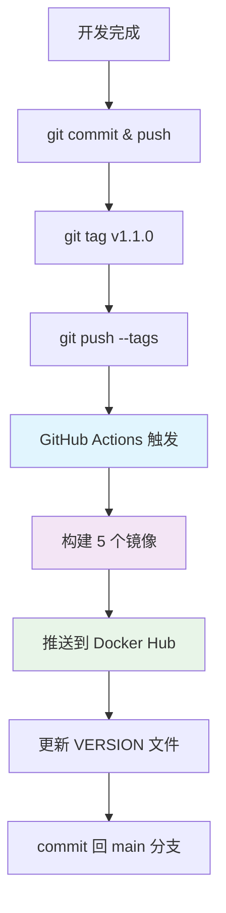
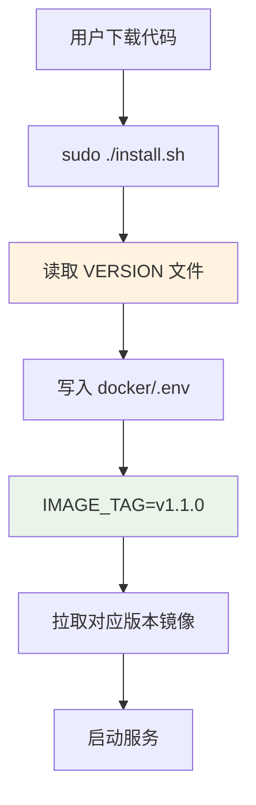
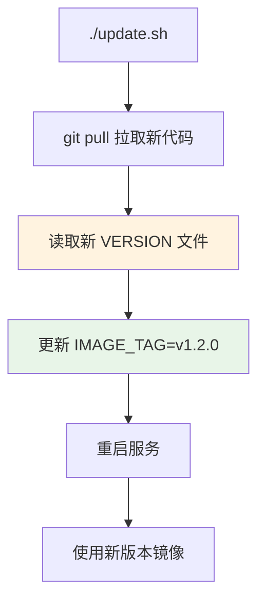
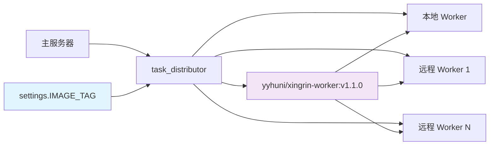
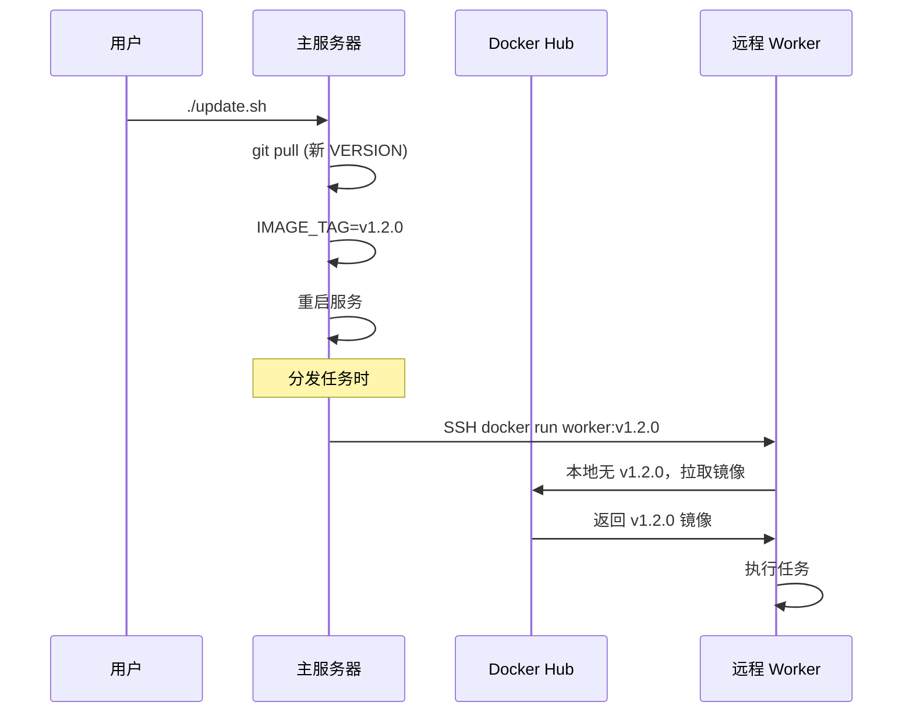

# XingRin - 星环 版本管理架构

## 概述

XingRin - 星环 采用基于 Git Tag 的自动化版本管理系统，确保所有组件（主服务器、远程 Worker）使用一致的版本，避免兼容性问题。

## 核心原理

### 版本号来源
- **单一版本源**：Git Tag（如 `v1.1.0`）
- **版本文件**：`VERSION` 文件由 CI 自动维护
- **环境变量**：`IMAGE_TAG` 锁定运行时版本

### 版本一致性保证
```
Git Tag → CI 构建镜像 → VERSION 文件 → IMAGE_TAG → 所有节点统一版本
```

## 完整发布流程



### 镜像构建矩阵
| 镜像 | 用途 | 标签 |
|------|------|------|
| `xingrin-server` | 主服务器 | `v1.1.0` + `latest` |
| `xingrin-frontend` | 前端界面 | `v1.1.0` + `latest` |
| `xingrin-nginx` | 反向代理 | `v1.1.0` + `latest` |
| `xingrin-worker` | 任务执行 | `v1.1.0` + `latest` |
| `xingrin-agent` | 心跳监控 | `v1.1.0` + `latest` |

## 用户部署流程

### 初始安装


### 版本更新


## 任务分发架构

### 镜像版本管理


### 执行流程对比

| 场景 | 镜像拉取策略 | 说明 |
|------|-------------|------|
| **本地 Worker** | `--pull=missing` | 主服务器本机执行，使用本地镜像 |
| **远程 Worker** | `--pull=missing` | SSH 到远程执行，使用远程本地镜像 |

## 镜像拉取策略

### 安装时预拉取
```bash
# 主服务器安装
docker compose up -d  # 拉取所有服务镜像

# 远程 Worker 安装  
docker pull yyhuni/xingrin-worker:v1.1.0  # 预拉取 worker 镜像
```

### 执行时策略
```bash
# 任务执行时
docker run --pull=missing yyhuni/xingrin-worker:v1.1.0
```

**`--pull=missing` 行为**：
- ✅ 本地有镜像 → 直接使用，不检查网络
- ✅ 本地无镜像 → 从 Docker Hub 拉取
- ✅ 版本更新后 → 自动拉取新版本

## 版本同步机制

### 主服务器更新


### 版本一致性保证
1. **主服务器**：`IMAGE_TAG` 锁定版本
2. **远程 Worker**：按需拉取对应版本
3. **自动同步**：update.sh 统一更新版本号

## 开发环境配置

### 本地开发测试
```bash
# docker/.env 中添加
TASK_EXECUTOR_IMAGE=docker-agent:latest  # 指向本地构建镜像
```

### 开发模式启动
```bash
# 使用本地构建镜像
./install.sh --dev
./start.sh --dev
```

## 配置文件说明

### VERSION 文件
```
v1.1.0
```
- 由 CI 自动维护
- 用户安装时读取此文件

### docker/.env
```bash
IMAGE_TAG=v1.1.0                    # 锁定版本
TASK_EXECUTOR_IMAGE=                # 可选：覆盖镜像名
```

### settings.py 逻辑
```python
if IMAGE_TAG:
    # 主服务器：构建镜像名
    TASK_EXECUTOR_IMAGE = f'{DOCKER_USER}/xingrin-worker:{IMAGE_TAG}'
else:
    # Worker 容器：不需要此配置
    TASK_EXECUTOR_IMAGE = ''
```

## 故障排查

### 版本不一致问题
**症状**：任务执行失败，兼容性错误

**排查**：
```bash
# 检查主服务器版本
cat VERSION
grep IMAGE_TAG docker/.env

# 检查远程 Worker 镜像
ssh worker_host "docker images | grep xingrin-worker"
```

**解决**：
```bash
# 主服务器更新
./update.sh

# 远程 Worker 会自动拉取新版本（下次任务执行时）
```

### 镜像拉取失败
**症状**：`docker run` 报错，无法拉取镜像

**排查**：
```bash
# 检查网络连接
docker pull yyhuni/xingrin-worker:v1.1.0

# 检查版本是否存在
curl -s https://hub.docker.com/v2/repositories/yyhuni/xingrin-worker/tags/
```

## 最佳实践

### 版本发布
1. ✅ 严格遵循语义化版本（v1.2.3）
2. ✅ 有改动必须更新版本号
3. ✅ 通过 CI 自动构建，不手动推送
4. ✅ 测试版本使用 `-dev.x` 后缀

### 部署运维
1. ✅ 定期执行 `./update.sh` 获取更新
2. ✅ 监控 Docker Hub 镜像拉取状态
3. ✅ 备份重要配置文件（.env）
4. ✅ 使用 `docker system prune` 清理旧镜像

### 开发调试
1. ✅ 本地测试使用 `--dev` 模式
2. ✅ 远程测试先推送测试版本到 Hub
3. ✅ 生产环境避免使用 `latest` 标签
4. ✅ 版本回滚通过修改 `IMAGE_TAG` 实现